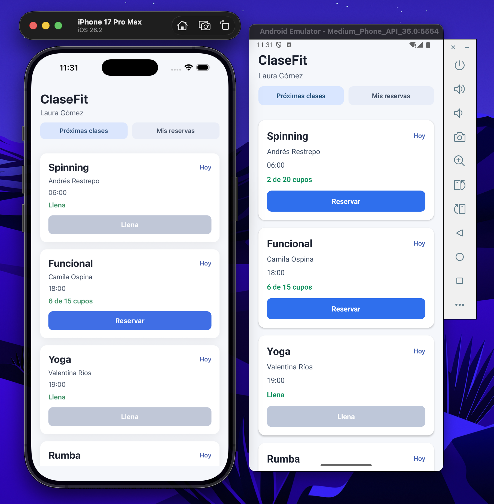

# ClaseFit

Aplicación móvil de reservas de clases con enfoque MVP, desarrollada en React Native + Expo + TypeScript.

## Expo Internal Distribution Build
```
https://expo.dev/accounts/daviddiazh/projects/clasefit-daviddiazh/builds/74df8c65-7628-49a3-9907-de1688871776
```

## Requisitos
- Node.js 18+
- npm o yarn
- Expo CLI
- Android Studio / Xcode para emulación nativa o uso de Expo Go

## Instalación
```bash
npm install
```

## Cómo correr la app
### Opción 1: Android / iOS emulador
```bash
npm start
```
Luego desde la terminal de Expo seleccionar:
- a: Android
- i: iOS
- w: web
```

## Ejecutar pruebas
```bash
npm test -- --runInBand
```

## Estructura principal
- `src/App.tsx`: pantalla principal y flujo de UI
- `src/context/ClassBookingContext.tsx`: estado global y acciones de reserva/cancelación
- `src/utils/classBooking.ts`: lógica de negocio y reglas de dominio
- `src/utils/classBooking.test.ts`: pruebas automatizadas de negocio
- `mock-data/clases.json`: datos base de ejemplo
- `openspec/`: especificaciones y artefactos del workflow OpenSpec

## Funcionalidades clave
- Ver clases próximas
- Reservar una clase si hay cupos
- Validar reglas de negocio y límite diario
- Ver mis reservas
- Cancelar una reserva si faltan al menos 2 horas
- Mostrar mensajes claros de éxito y error

## Demo

### Vista previa


### Video de la demo
<video src="./demo/demo.mov" controls muted playsinline width="800"></video>

## Notas
- El proyecto está orientado a un MVP local sin backend real.
- La lógica de negocio está separada de la UI para facilitar pruebas automatizadas.
